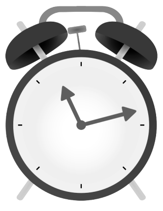

# Steps to getting started



Lightweight version: 

```shell
#!/usr/bin/env bash

# requires: `brew install coreutils sox`
# glseep can be passed seconds, minutes, hours: 10s, 10m, 10h

main() {
    echo "start timer"
    local amount="$1"
    /usr/local/bin/gsleep "$amount"; and play ./sounds/rooster.mp3
    echo "stop"
}

main "$1"

```

## Set up your cronjob 

* To edit your cronjob, enter in the following command @ your terminal: 

```
crontab -e
```

* Here is an example crontab entry @ 6:45 A.M. M-F created using [corn-tab](http://www.corntab.com/pages/crontab-gui)

```
45 6 * * 1,2,3,4,5 /Users/username/git/alarm-clock/scripts/alarm.sh
```

## Set up crontab user with sudo rights

* In order to turn the volume up, the crontab user will need to have sudo rights, to make sure of this follow the instructions found @ [how-to-become-sudo](https://www.garron.me/en/linux/visudo-command-sudoers-file-sudo-default-editor.html)

* Here is a summery of the process(visudo doc is tab delimited): 
```
1. Switch to root, (su root), then run visudo, (as above).
2  Find where it says "root ALL=(ALL) ALL".
3. Type "o" to insert a new line below it.
4. Now type what you want to insert, eg "username ALL=(ALL) ALL".
5. Hit esc to exit insert-mode.
6. Type ":x" to save and exit.
```

* You will also need to add youself to the document to make sure that you are not prompted w/ a p/w
** Remember sudo visudo is tab delmited)

```
1.  run sudo visudo 
2.  Enter your username like so: username    ALL=(root) NOPASSWD: ALL
```

## Run setup.sh

* This will create a symlink from the kill_alarm.sh script and place it on your Desktop. 
* You will need to run this script to kill the alarm.
* Follow the instructions on the following site: [clickable-shell-scripts-on-mac](http://stackoverflow.com/questions/5125907/how-to-run-a-shell-script-in-os-x-by-double-clicking) to make sure the your Mac environment is correctly set up in order to simply double click on the script to kill the alarm.


## Set up your alarm-playlist.txt

* You can add the following sounds (mp3s found in the sound folder) to your alarm-playlist.txt
* Feel free to add your own mp3s to the sound folder and then add them to the alarm-playlist.txt file

```
computer.mp3
cosmic.mp3
cow.mp3
digital.mp3
farm.mp3
forest.mp3
ocean.mp3
ringer.mp3
rooster.mp3
```
